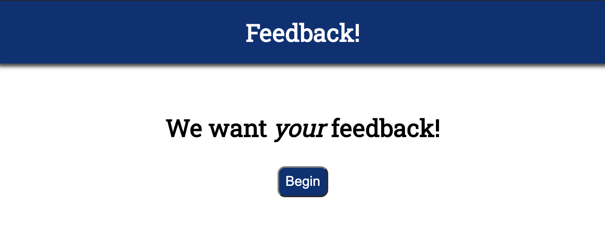
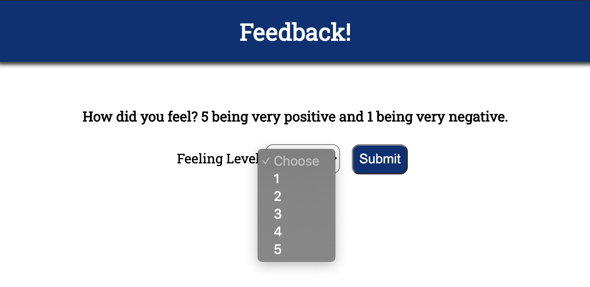
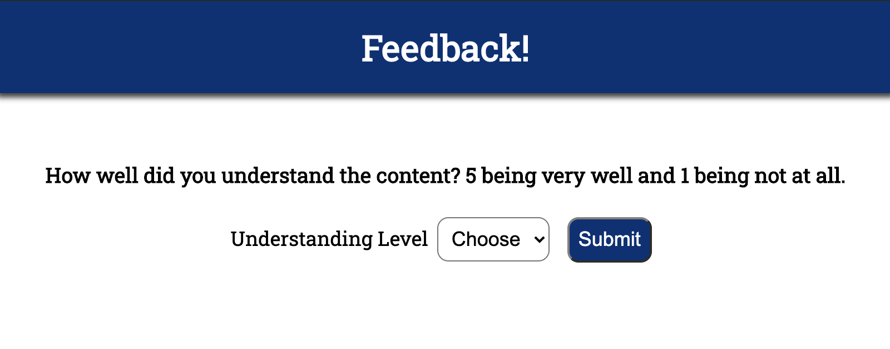
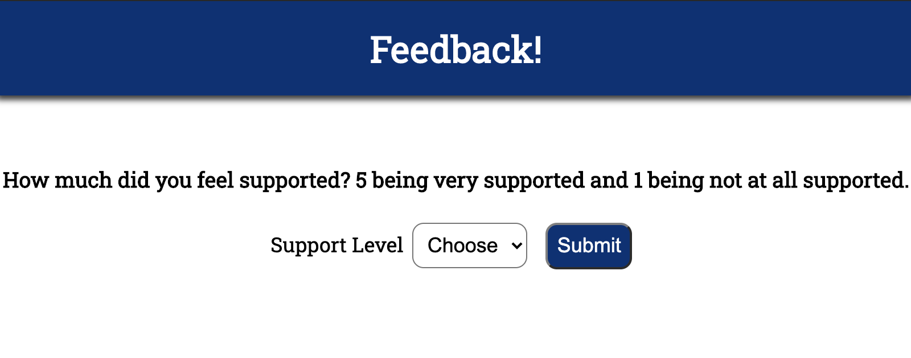
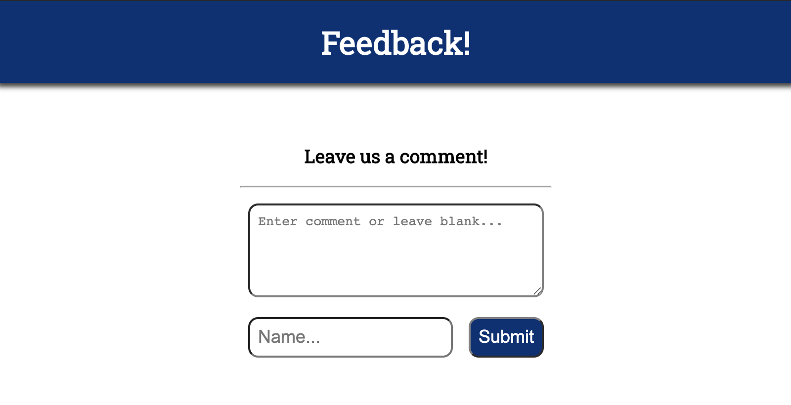
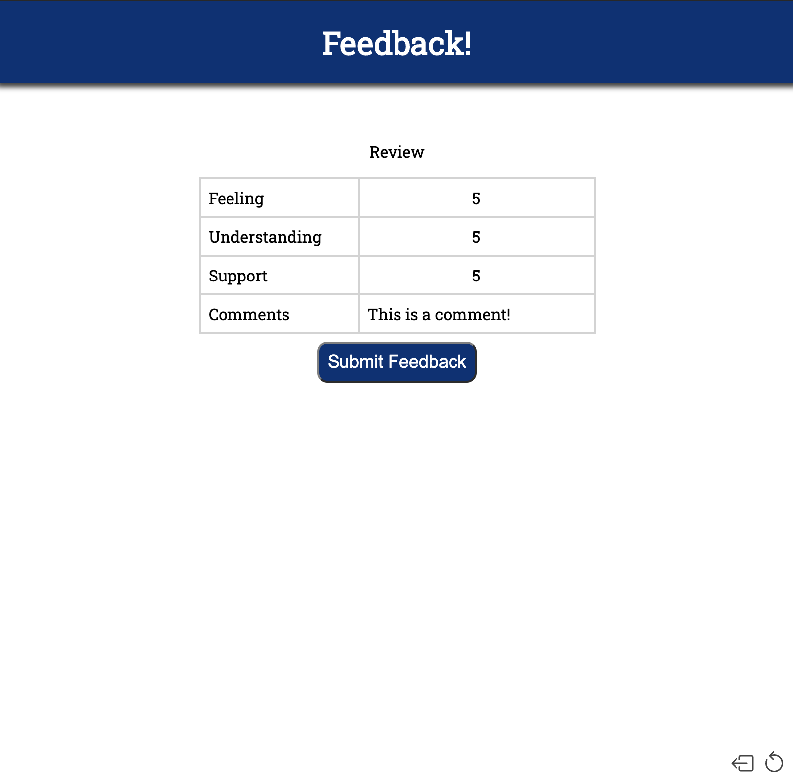

# Redux Feedback Loop

EDA Feedback Form

## Description

This project aims to recreate a feedback form similar to that of EDA's. It contains four input pages in which you provide your level of feeling, understanding, support, and also any comments you may have to add. Upon pressing submit on the final review page, a post request will be sent to the server, where the server will then take that information and make a query to a database to save the information you provided.

This next image shows the back and reset buttons in the bottom right of the screen. These buttons are present on most of the pages.

